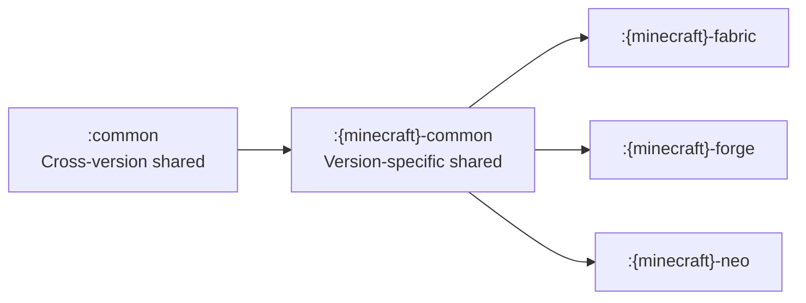
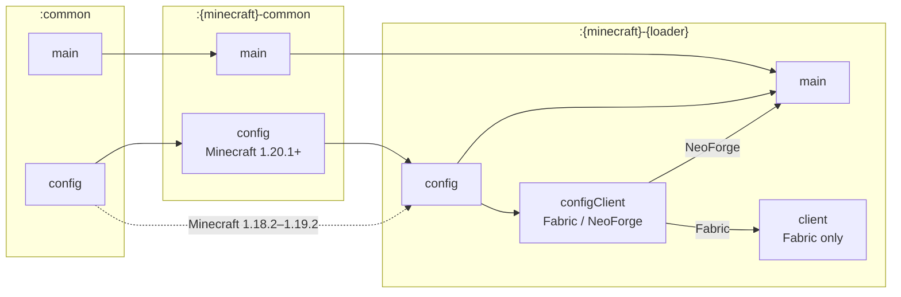

# custom-mdk テンプレートガイド

[English](README.md) | [日本語](README.ja.md)

単一のGradleマルチプロジェクトビルドによって、複数のMinecraftバージョンとModローダーに対応するMinecraft Modテンプレートです。Kotlin DSLによるビルドロジック、共有ソースセット、Mixin対応、利用可能な環境でのParchmentマッピング、Modメタデータの生成、バージョン付きアーティファクト名、Javaツールチェーン管理、ランタイムModのステージング、ビルド用GitHub Actionsが含まれます。

## 対応プラットフォーム

| Minecraft | Fabric | LexForge | NeoForge |
|-----------|:------:|:--------:|:--------:|
| 1.7.10    |   🚫   |    ✅    |    -     |
| 1.12.2    |   🚫   |    ⏳    |    -     |
| 1.16.5    |   🚫   |    🚫    |    -     |
| 1.18.2    |   ✅   |    ✅    |    -     |
| 1.19.2    |   ✅   |    ✅    |    -     |
| 1.20.1    |   ✅   |    ✅    |    🚫    |
| 1.21.1    |   ✅   |    ✅    |    ✅    |
| 1.21.8    |   ✅   |    ✅    |    ❌    |
| 1.21.11   |   ✅   |    ✅    |    ❌    |
| 26.1      |   ✅   |    ❌    |    ✅    |
| 26.1.2    |   🌟   |    ❌    |    🌟    |
| 26.2      |   ✅   |    🚫    |    ✅    |

🌟 主要サポート | ✅ サポート済み | 🚧 部分的サポート | ⏳ 対応予定 | ❌ 未対応 | 🚫 対応対象外

`settings.gradle.kts`に含まれるサブプロジェクトだけが設定されます。不要なバージョンやローダーがある場合は、使用しない`include(...)`行をコメントアウトしてください。

LLMエージェントと自動化ツールは、このテンプレートを編集する前に[MDK Agent Notes](mdk/README.md)も参照してください。このエージェント向けドキュメントは英語のみです。

## プロジェクト構成

- `common`: 単独の1.7.10 Forgeプロジェクトを除く、対応ターゲットで使用する共有Javaコードです。
- `<minecraft>/common`: Minecraftバージョン固有の共有コードです。古いバージョンではLexForge Legacyツールチェーンを使用し、1.21以降と26.xではNeoForge ModDev経由でNeoFormを使用します。
- `<minecraft>/fabric`: Fabricローダープロジェクトです。
- `<minecraft>/forge`: LexForgeローダープロジェクトです。ForgeGradle 7以降のターゲットでは`lexforge-*`規約を、それ以前のターゲットでは`lexforge-legacy-*`規約を使用します。
- `<minecraft>/neo`: NeoForgeローダープロジェクトです。
- `1.7.10/forge`: GTNHGradleでビルドする単独のForgeプロジェクトです。他のローダープロジェクトとは異なり、対応する`1.7.10/common`プロジェクトを使用しません。
- `src/config`: jarに含まれますが、デフォルトのmainソースセットからは分離された、設定関連の共通コードです。
- `src/configClient`: 設定UIを提供するローダー向けのクライアント専用設定画面ヘルパーです。
- `buildSrc`: ローダー固有のGradle動作を定義する規約プラグインです。
- `gradle.properties`: 生成される`mods.toml`、`neoforge.mods.toml`、`fabric.mod.json`で共有するModメタデータです。
- `version.txt`: プロジェクトのバージョン、アーティファクト名、生成メタデータに使うModバージョンです。

### プロジェクトの依存関係

矢印は、共有コードからそれを利用するプロジェクトへ向いています。利用可能なローダープロジェクトは、上記の対応プラットフォーム表のとおり、Minecraftバージョンによって異なります。単独の1.7.10 Forgeプロジェクトはこのグラフに含まれません。


<details>
<summary>上記画像のMermaidソース</summary>



</details>

## セットアップ

IntelliJ IDEAまたはGradleでプロジェクトを開いたりインポートしたりする前に、`settings.gradle.kts`を整理してください。含まれるプロジェクトが増えるほど、Gradleの設定処理とIDEのインポートに時間がかかります。最初に、使用しない`include(...)`行をコメントアウトしてください。

1. GitHubで**Use this template**をクリックし、このテンプレートからリポジトリを作成します。
2. テンプレートの更新を継続して取り込みたい場合は、通常の開発を始める前に[上流への追従](#上流への追従)を実施します。
3. `settings.gradle.kts`を編集し、使用しない`include(...)`行をコメントアウトして、Gradleの設定時間とキャッシュ使用量を減らします。
4. `gradle.properties`でMod ID、名前、グループ、ライセンス、作者、URL、Fabricエントリーポイントを編集し、`version.txt`でModバージョンを編集します。
5. 他のModとの競合を避けるため、共有設定システム内のものを含む、すべてのJavaパッケージ名を変更します。`Constants`、エントリーポイント、Mixin設定名、refmap名、言語アセット内の`examplemod`をMod IDに置き換えてください。
6. Mod用のルート`README.md`と`LICENSE`を作成します。将来のテンプレート更新をきれいにマージしたい場合は、`docs/*.md`を変更せずに維持してください。

## 生成されるメタデータ

Fabricの`fabric.mod.json`は、`gradle.properties`、`version.txt`、Fabric規約プラグインの共有値から生成されます。この規約は、Mod ID、バージョン、作者、連絡先URL、環境、エントリーポイント、Java要件、Minecraft要件、Fabric API依存関係、任意のForge Config API Port依存関係などの共通フィールドを提供します。

各`<minecraft>/fabric/src/main/templates/fabric.mod.json`は、小さな上書き用JSONファイルです。そこに書いた値は生成されるデフォルト値に重ねてマージされるため、共通メタデータを重複させず、ターゲット固有のメタデータや追加の依存関係を指定できます。`depends`などのネストされたオブジェクトも再帰的にマージされます。

単独の1.7.10 Forgeプロジェクトは`1.7.10/forge/src/main/resources/mcmod.info`を使用します。そのビルドでは、GTNHGradleを通じてルートの共有Modメタデータをこのファイルへ反映します。

## 要件

- Gradleの設定にはJDK 25を推奨します。GitHub Actionsのビルド環境にも一致します。
- LinuxおよびAppleシリコン搭載macOSでは、`nix develop`によりJDK 25とリポジトリの開発ツールを利用できます。
- Gradleは、各Minecraftバージョンに必要なツールチェーンをFoojay Toolchain Resolverでダウンロードします。
- 現在、各バージョンターゲットでは次のJava言語・バイトコードレベルを使用します。
  - Java 8: `1.7.10`
  - Java 17: `common`、`1.18.2`、`1.19.2`、`1.20.1`
  - Java 21: `1.21.1`、`1.21.8`、`1.21.11`
  - Java 25: `26.1`、`26.1.2`

## ビルド

macOSまたはLinuxですべての対象サブプロジェクトをビルドするには、次を実行します。

```sh
./gradlew build
```

Windowsでは次を実行します。

```sh
./gradlew.bat build
```

特定のプラットフォームをビルドするには、次のように実行します。

```sh
./gradlew :1.7.10-forge:build
./gradlew :26.1.2-fabric:build
./gradlew :26.1.2-neo:build
```

アーティファクトは、各設定済みプロジェクトのディレクトリ配下（例: `26.1.2/fabric/build/libs/`）に出力されます。`ciRuntimeMods`で宣言された追加のランタイム専用Mod jarは、CI用としてそのプロジェクトディレクトリの`build/ciRuntimeMods/`に集められます。

各ローダー規約では、プラットフォームの種別とリリースアーティファクトを生成するGradleタスクを`platformArtifacts`で宣言します。生成されるCIマトリクスには、それらのタスクが実際に生成するアーカイブファイル名が記録されます。sourcesタスクを設定すると、そのsources jarは必須のリリースアーティファクトになります。意図的にsources jarを生成しないプラットフォームでは、sourcesタスクの宣言を省略してください。

## 実行

クライアントを実行するには、次のようにします。

```sh
./gradlew :1.7.10-forge:runClient
./gradlew :26.1.2-fabric:runClient
./gradlew :26.1.2-neo:runClient
```

サーバーを実行するには、次のようにします。

```sh
./gradlew :1.7.10-forge:runServer
./gradlew :26.1.2-fabric:runServer
./gradlew :26.1.2-neo:runServer
```

## 依存関係

共有する依存関係のエイリアスには`gradle/libs.versions.toml`を使用し、ターゲット固有のバージョンは対象サブプロジェクトの`gradle.properties`に保持してください。

通常のバージョン要求には`req(version)`を使用し、Gradleに他の選択バージョンをすべて拒否させる必要がある場合に限り`pin(version)`を使用します。

```kotlin
import net.meatwo310.mdk.build.req

val modmenuVersion: String by project

dependencies {
    modRuntimeOnly(libs.modmenu, req(modmenuVersion))
    // 次とまったく同じです:
    //   modRuntimeOnly(libs.modmenu) { version { require(modmenuVersion) } }
}
```

コンパイルとローカル実行の設定は、ターゲットに応じて選択します。

| ターゲット | コードが依存先のクラスをimportする | ローカルの`runClient` / `runServer`のみ |
|------------|-------------------------------------|------------------------------------------|
| Fabric 1.21.11以前 | `modImplementation(...)` | `modRuntimeOnly(...)` |
| LexForge Legacy | `implementation(...)` | `modRuntimeOnly(...)` |
| Fabric 26.1以降、LexForge、NeoForge | `implementation(...)` | `runtimeOnly(...)` |

CIランタイムへの配置方法は、すべてのターゲットで共通です。

| 用途 | 宣言 |
|------|------|
| GitHub Actionsのランタイムテストでjarをインストールする | `ciRuntimeMods(...)` |
| コードからimportし、CIでもインストールする | 上表のコンパイル依存関係と`ciRuntimeMods(...)` |

`ciRuntimeMods`はローカルの`runClient` / `runServer`クラスパスには影響しません。GitHub Actionsのランタイムテスト用に、直接指定されたjarファイルを各設定済みプロジェクトディレクトリの`build/ciRuntimeMods`へ配置するだけです。本番用ローダーメタデータも別に管理されます。リリースしたModの利用者が依存関係をインストールする必要がある場合に限り、Fabricの`depends`、LexForgeの`mods.toml`依存関係、またはNeoForgeの`neoforge.mods.toml`依存関係を追加してください。

### Minecraft 1.7.10の依存関係

GTNHGradleを使用する1.7.10プロジェクトでは、依存関係の宣言を`1.7.10/forge/dependencies.gradle`に、追加のリポジトリを`1.7.10/forge/repositories.gradle`に保持します。`dependencies.gradle`に記載された設定を使用してください。たとえば、コンパイル時とローカル実行時に必要でMaven依存関係として公開しない依存関係には`devOnlyNonPublishable`を、ローカル実行時だけ必要な依存関係には`runtimeOnlyNonPublishable`を使用します。ターゲット、Forge、マッピング、GTNHGradleのオプションは`1.7.10/forge/gradle.properties`に保持してください。

## 設定システム

共有設定エントリーは`common/src/config/java/.../config`にあります。`ConfigEntryBuilder`でエントリーを定義し、`ConfigEntries`としてまとめ、`ModConfigs`内の`ConfigDeclaration`を通じて各ファイルを公開します。

設定サポートは専用のソースセットに分割されているため、設定規約を使用しないプロジェクトは追加の設定依存関係を解決せずに済みます。共有設定の宣言は`common/src/config`、バージョン固有の設定コードは`<minecraft>/common/src/config`、ローダーとの連携は`<minecraft>/<loader>/src/config`、クライアント専用の設定画面ヘルパーは`<minecraft>/<loader>/src/configClient`に配置します。

ソースセットはプロジェクトと同じ階層構造に従います。点線の辺は、バージョン固有の`config`ソースセットがない場合に使う従来の経路です。


<details>
<summary>上記画像のMermaidソース</summary>



</details>

読みやすさのため、設定関連の辺は論理的な階層を示しています。規約は、利用可能なすべての上流`config`出力を下流のクラスパスとjarへ直接追加します。

Fabricは`configClient`を作成して`client`へ接続します。クライアント設定ヘルパーを提供しない古いターゲットでは、このソースセットは空です。NeoForgeは`configClient`を`main`へ接続します。LexForgeは、これらのクライアント固有ソースセットをどちらも作成しません。

プロジェクトで設定サポートが必要な場合は、通常のローダー規約に加えて、対応する設定規約プラグインを適用します。

| プロジェクト種別 | 設定規約 |
|------------------|----------|
| `common` | `common-config-conventions` |
| LexForge Legacyのバージョン共通 | `lexforge-legacy-common-config-conventions` |
| NeoForgeのバージョン共通 | `neoforge-common-config-conventions` |
| LexForge Legacyローダープロジェクト | `lexforge-legacy-config-conventions` |
| LexForgeローダープロジェクト | `lexforge-config-conventions` |
| Fabricローダープロジェクト（1.20.1以降） | `fabric-config-conventions` |
| Fabric Legacyローダープロジェクト（1.18.2～1.19.2） | `fabric-legacy-config-conventions` |
| NeoForgeローダープロジェクト | `neoforge-config-conventions` |

これらの規約は、`config`と`configClient`の出力をjarと適切なコンパイル・ランタイムクラスパスへ接続します。FabricとLexForgeの設定プロジェクトは、Forge Config API Portもコンパイルクラスパス、`ciRuntimeMods`、生成されるローダーメタデータに追加します。ローダーの設定規約を削除すると、基本のローダー規約からこの連携が切り離されます。

Fabric 1.18.2～1.19.2では、独立したcommonアーティファクトを持たない、アーカイブ済みの`net.minecraftforge:forgeconfigapiport-fabric`アーティファクトを使用します。`VersionedConfigSpec`やその他のForge Config API Port連携は、Fabricプロジェクトの`src/config`に置いてください。`fabric-legacy-config-conventions`はルート`common`の中立な宣言を使用し、`<minecraft>/common/src/config`を任意として扱います。`fabric-config-conventions`と同時に適用しないでください。

ビルダーは、プリミティブ値、範囲付き数値、文字列、リスト、enum、ネストしたセクションをサポートします。連続した`comment(...)`呼び出しは改行で結合され、次のエントリーまたはカテゴリーに適用されます。カテゴリーパスに関係なく、次のエントリーまたはカテゴリーへ正確な翻訳キーを割り当てるには`translation(...)`を使用します。すべてのプラットフォームでエントリーに`worldRestart()`を、NeoForgeでは`gameRestart()`を指定できます。Forge Config APIを使うプラットフォームでは`gameRestart()`が無視されます。階層的な設定には、`category(...)`とネストしたクラスを推奨します。`push(...)`、`pop()`、`pop(int count)`は、低レベルのアダプター処理や特殊な移行処理に使用してください。

```java
package net.meatwo310.examplemod.config;

import net.meatwo310.examplemod.mdk.config.ConfigEntries;
import net.meatwo310.examplemod.mdk.config.ConfigEntry;
import net.meatwo310.examplemod.mdk.config.ConfigEntryBuilder;

import java.util.List;

public final class ServerConfig {
    private static final ConfigEntryBuilder BUILDER = new ConfigEntryBuilder();

    public static final ConfigEntry.BooleanEntry ENABLE_FEATURE = BUILDER
            .comment("Enable the main server feature.")
            .define("enableFeature", true);

    public static final ConfigEntry.IntEntry MAX_STORED_ITEMS = BUILDER
            .comment("Maximum number of stored items.")
            .defineInRange("maxStoredItems", 64, 1, 4096);

    public static final ConfigEntry.ListEntry<String> ALLOWED_ITEMS = BUILDER
            .comment("Item ids accepted by the feature.")
            .defineList(
                    "allowedItems",
                    List.of("minecraft:stone"),
                    () -> "minecraft:stone",
                    value -> value instanceof String);

    public static final ConfigEntries ADVANCED = BUILDER
            .comment("Advanced server settings.")
            .category("advanced", Advanced.ENTRIES);

    public static final class Advanced {
        private static final ConfigEntryBuilder BUILDER = new ConfigEntryBuilder();

        public static final ConfigEntry.BooleanEntry ENABLE_DEBUG_LOG = BUILDER
                .comment("Enable additional debug logging.")
                .define("enableDebugLog", false);

        public static final ConfigEntry.DoubleEntry SPAWN_RATE_MULTIPLIER = BUILDER
                .comment("Multiplier applied to spawn rate.")
                .defineInRange("spawnRateMultiplier", 1.0D, 0.0D, 10.0D);

        public static final ConfigEntries PERFORMANCE = BUILDER
                .comment("Performance tuning.")
                .category("performance", Performance.ENTRIES);

        public static final class Performance {
            private static final ConfigEntryBuilder BUILDER = new ConfigEntryBuilder();

            public static final ConfigEntry.IntEntry CACHE_SIZE = BUILDER
                    .comment("Maximum cache size.")
                    .defineInRange("cacheSize", 256, 0, 8192);

            public static final ConfigEntries ENTRIES = BUILDER.build();
        }

        public static final ConfigEntries ENTRIES = BUILDER.build();
    }

    public static final ConfigEntries ENTRIES = BUILDER.build();
}
```

これにより、次のような構造が生成されます。

```toml
enableFeature = true
maxStoredItems = 64
allowedItems = ["minecraft:stone"]

[advanced]
enableDebugLog = false
spawnRateMultiplier = 1.0

[advanced.performance]
cacheSize = 256
```

設定ファイルは、`ModConfigs`内の`ConfigDeclaration`を通じて公開します。

```java
public final class ModConfigs {
    public static final ConfigDeclaration SERVER =
            ConfigDeclaration.of(ConfigSide.SERVER, ServerConfig.ENTRIES);
    public static final ConfigDeclaration CLIENT =
            ConfigDeclaration.of(ConfigSide.CLIENT, ClientConfig.ENTRIES, "examplemod-client-special.toml");

    public static final List<ConfigDeclaration> ALL = List.of(SERVER, CLIENT);
}
```

公開されたエントリーから値を直接読み取ります。

```java
if (ServerConfig.ENABLE_FEATURE.getAsBoolean()) {
    int cacheSize = ServerConfig.Advanced.Performance.CACHE_SIZE.getAsInt();
}
```

`ConfigSide.SERVER`、`ConfigSide.CLIENT`、`ConfigSide.COMMON`は、各プラットフォームによってローダー固有の設定種別に割り当てられます。ワールドまたはサーバーが管理するゲームプレイルールやバランス値には`SERVER`、描画やUIなどのローカル設定には`CLIENT`、物理サイドごとに独立して読み込むインストール全体のデフォルト値には`COMMON`を使用します。任意のファイル名はローダーAPIへそのまま渡されます。ローダーのデフォルトを使う場合は省略してください。

共通設定の宣言はローダーに依存しません。各プラットフォームは、対象に必要な依存関係と登録処理に加えて、設定画面を公開する場合は任意のクライアント側ヘルパーを提供します。

| ターゲット | 必須の設定依存関係 | 登録方法 | 任意の設定画面依存関係 |
|------------|--------------------|----------|------------------------|
| NeoForgeプラットフォーム | ローダーに含まれるNeoForge設定API | `ModContainer#registerConfig` | なし。設定画面はNeoForgeが直接提供します |
| LexForge Legacyプラットフォーム | ローダーに含まれるForge設定API | `ModLoadingContext` / `FMLJavaModLoadingContext` | [Configured](https://www.curseforge.com/minecraft/mc-mods/configured)または[Forge Config Screens](https://modrinth.com/mod/forge-config-screens) |
| LexForgeプラットフォーム | Forge Config API Port | Forge Config API Portレジストリー | なし。Forge Config API Portに設定画面は同梱されず、NeoForge形式のspecはConfiguredでも認識されません |
| Fabricプラットフォーム | Minecraftバージョンごとに宣言するForge Config API Port | Forge Config API Portレジストリー | Mod一覧の項目には[ModMenu](https://modrinth.com/mod/modmenu/)、mc1.20.1以前では[Forge Config Screens](https://modrinth.com/mod/forge-config-screens) |

この仕組みにより、同じ`ConfigDeclaration`リストを`common`から共有し、バージョン固有のcommonプロジェクトで拡張したうえで、各プラットフォームが実際に使用する依存関係へ結び付けられます。

このテンプレートは`ModConfigs.ALL`を直接登録します。対象に含まれるすべてのターゲットで同じ設定ファイルを共有できる場合に使用してください。

```java
PlatformConfigRegistrar.registerAll(modContainer, VersionedConfigSpec.bindAll(ModConfigs.ALL));
```

Fabricでも同じ流れを使用しますが、`ModContainer`の代わりにMod IDを渡します。

```java
PlatformConfigRegistrar.registerAll(Constants.MODID, VersionedConfigSpec.bindAll(ModConfigs.ALL));
```

`26.1.2/common`内の`26.1.2-common`など、バージョン固有のcommonプロジェクトで追加エントリーが必要な場合は、プラットフォームが宣言を結び付ける前に追記します。

```java
public final class VersionedModConfigs {
    public static final List<ConfigDeclaration> ALL =
            ConfigDeclarations.append(ModConfigs.ALL, ModConfigs.SERVER, VersionedServerConfig.ENTRIES);
}
```

`26.1.2/fabric`内の`26.1.2-fabric`や`26.1.2/neo`内の`26.1.2-neo`など、プラットフォーム固有のエントリーが必要な場合は、`PlatformConfigRegistrar`を呼び出す前にエントリーポイントで追記します。

```java
var configs = ConfigDeclarations.append(VersionedModConfigs.ALL, ModConfigs.SERVER, NeoServerConfig.ENTRIES);
PlatformConfigRegistrar.registerAll(modContainer, VersionedConfigSpec.bindAll(configs));
```

## GitHub Actions

ビルドワークフローは`settings.gradle.kts`からサブプロジェクトを検出し、それぞれを個別にビルドしてローダーのアーティファクトをアップロードします。利用可能なサーバーまたはゲームテストのスモークチェックを実行し、スモークテストに`runServer`を使う場合はシャットダウンログを検証したうえで、生成したjarを使ったヘッドレスクライアントのランタイムテストを開始します。ほとんどのローダープロジェクトでは対応する`<minecraft>-common`プロジェクトが必要ですが、単独の`1.7.10-forge`プロジェクトは`ciRequiresCommon=false`でこの要件を無効にしています。なお、Fabric Game TestsはFabric Loomを通じて設定され、Fabricの`build`タスクの一部として実行されます。

### リリースCI

Releaseワークフローは、対象となるすべてのプラットフォームプロジェクトをビルドし、配布用jarを集め、最新の`v*`タグ以降のコミットからリリースノートを生成して、新しいタグとjarを添付したGitHub Releaseを公開します。

リリースを公開する手順は次のとおりです。

1. GitHubで**Actions** > **Release** > **Run workflow**を開きます。
2. リリースするブランチを選択します。
3. バージョンの更新種別を選び、ワークフローを実行します。

利用できる更新種別は次のとおりです。

| 種別 | 動作 |
|------|------|
| `auto` | 破壊的変更（`!`または`BREAKING CHANGE:`）なら`major`、`feat`なら`minor`、それ以外は`patch`を選びます。`mdk`種別のコミットは無視されます。 |
| `none` | `version.txt`に保存済みのバージョンを変更せずに公開します。ワークフローを実行する前に、目的のバージョンをコミットしてpushしてください。 |
| `patch` | パッチバージョンを増やします。 |
| `minor` | マイナーバージョンを増やします。 |
| `major` | メジャーバージョンを増やします。 |

`none`以外では、ワークフローが`version.txt`を更新し、`release: <version>`としてローカルにコミットしてリリースをビルドします。その後、jarとリリースノートの準備が完了してから、選択したブランチへコミットとリリースタグをpushします。リリースノートには破壊的変更、`feat`、`fix`、`perf`コミットが含まれます。`mdk`種別のテンプレートメンテナンスコミットと、その他の種別は除外されます。

### CurseForgeとModrinthへの公開

独立したPublishワークフローは、既存のGitHub Releaseからjarとリリースノートをコピーし、CurseForge、Modrinth、またはその両方へ公開します。デフォルトではドライランで、すべてのプラットフォームプロジェクト、または`1.20.1-fabric,1.21.1-neo`のようなカンマ区切りの一部プロジェクトを公開できます。

公開前に、次を設定します。

```kotlin
modPublishing {
    curseForge {
        projectId.set("123456")
        client.set(true)
        server.set(true)
    }
    modrinth {
        projectId.set("project-slug")
        environment.set(CLIENT_AND_SERVER)
    }
}
```

1. ルート`build.gradle.kts`の`modPublishing`ブロックで、公開先として選ぶ各サービスの`projectId`をコメント解除して入力します。
2. 選択する各サービスについて、同じブロック内のCurseForgeの`client`・`server`フラグ、またはModrinthの型付き`environment`値を確認します。これらはModをインストールできる環境を示し、ローダーのビルド設定から確実に推測することはできません。特にModrinthでは、`CLIENT_AND_SERVER`（両側に必要）と`CLIENT_OR_SERVER`（どちらか片側だけでもインストール可能）を区別します。
3. ドライランではなく公開する場合は、選択するサービスに必要な[GitHub Actionsのリポジトリシークレット](https://docs.github.com/ja/actions/how-tos/write-workflows/choose-what-workflows-do/use-secrets#creating-secrets-for-a-repository)として、`CURSEFORGE_TOKEN`、`MODRINTH_TOKEN`の一方または両方を追加します。
4. 対象タグのPublishを実行する前に、ReleaseワークフローでGitHub Releaseを作成します。

Publishワークフローの実行手順は次のとおりです。

1. GitHubで**Actions** > **Publish** > **Run workflow**を開きます。
2. **Use workflow from**で対象のGitHub Releaseタグを選択します。ブランチは選択しないでください。
3. 公開先サービスとその他の公開オプションを選択し、ワークフローを実行します。

アーティファクト名、Minecraftバージョン、ローダー名、Javaバージョン、任意のsources jar、規約が提供する公開用依存関係は、各プロジェクトの`platformArtifacts`メタデータから取得されます。`fabric-api-conventions`はFabric APIを登録し、FabricとモダンなLexForgeの設定規約はForge Config API Portを登録します。

公開用依存関係は、CurseForgeとModrinthのプロジェクトページ上の関連付けです。Gradle依存関係、ランタイムへのインストール、ローダーメタデータは設定しません。これらは[依存関係](#依存関係)の説明に従って個別に設定してください。

対象となる各プラットフォームサブプロジェクトの`build.gradle.kts`で、トップレベルの`platformArtifacts`配下に関連付けを宣言します。プラットフォーム規約プラグインが拡張を自動作成します。1.7.10プロジェクトでは、`configurePlatformArtifacts`より後にブロックを配置してください。

両方のサービスで同じslugを使う場合は、1つのslugを渡します。slugが異なる場合、または一方のサービスだけに関連付ける場合は、設定ブロックを使用します。

```kotlin
import net.meatwo310.mdk.build.platformArtifacts

platformArtifacts {
    publishingDependencies {
        required("same-slug-on-both-services")
        optional {
            curseForge = "dependency-curseforge-slug"
            modrinth = "dependency-modrinth-slug"
        }
        required {
            modrinth = "modrinth-only-dependency"
        }
    }
}
```

利用可能な関連種別は`required`、`optional`、`incompatible`、`embedded`です。`embedded`は依存関係がすでに含まれていることを宣言しますが、依存関係をアーティファクトへ組み込む機能ではありません。

アップロードせずに1つのターゲットをローカルで確認するには、次を実行します。

```sh
./gradlew publishMods \
  -PpublishGitHubRepository=owner/repository \
  -PpublishTag=v1.0.0 \
  -PpublishProjects=1.21.1-fabric \
  -PpublishDestination=modrinth \
  -PpublishDryRun=true
```

公開GitHub Releaseでは追加の認証は必要ありません。非公開リポジトリからダウンロードする場合や、認証済みAPIアクセスが必要な場合は`GITHUB_TOKEN`を設定してください。

`version.txt`と有効なプロジェクトが、選択したリリースと一致するチェックアウトを使用してください。ドライランのレポートは`build/publishMods/`に出力されます。

## 上流への追従

GitHubの**Use this template**ボタンで作成したリポジトリは、このテンプレートリポジトリとGit履歴を共有しません。テンプレートの更新を継続して取り込むには、通常の開発を始める前に、使用したテンプレートと一致する上流コミットを下流の履歴へ接続します。

このテンプレートリポジトリを`upstream`リモートとして追加します。

```sh
git remote add upstream https://github.com/Meatwo310/custom-mdk.git
git fetch upstream
```

下流リポジトリ作成時のテンプレートスナップショットとファイルが一致する上流コミットを探します。現在のテンプレートから作成した場合、通常は`upstream/main`です。古いテンプレートスナップショットから作成した場合は、対応する古い上流コミットを使用します。

```sh
upstream_snapshot=upstream/main
git diff --quiet main "$upstream_snapshot"
```

`git diff --quiet`コマンドは正常終了する必要があります。差分が報告された場合は、別の上流コミットを選んで再確認してください。

次に、一致する上流コミットを、作成直後のローカル`main`ブランチへマージします。

```sh
git switch main
git merge --allow-unrelated-histories --no-ff "$upstream_snapshot" \
  -m "mdk: connect upstream history"
git push origin main
```

これにより、下流リポジトリの最初のコミットをマージの第1親として維持しながら、テンプレートリポジトリの履歴を第2親として接続します。結果の履歴は次のようになります。

```text
*   <merge> (HEAD -> main) mdk: connect upstream history
|\
| * <upstream-snapshot> mdk: matching template change
| * ...
| * <upstream-root> chore: first commit
* <downstream-root> chore: first commit
```

一致するスナップショットを接続した後、必要に応じて最新の上流テンプレートをマージします。

```sh
git fetch upstream
git merge upstream/main
```

<details>
<summary>下流での開発をすでに始めている場合</summary>

下流にすでに変更があり、その履歴を書き換えられる場合は、下流のルートコミットから新しいブランチを作成し、そこで対応する上流スナップショットを接続してから、下流のコミットをその上に再適用します。

```sh
git switch main
git branch downstream-before-template-sync
downstream_snapshot=$(git rev-list --max-parents=0 HEAD)
upstream_snapshot=<matching-upstream-commit>
git diff --quiet "$downstream_snapshot" "$upstream_snapshot"

git switch -c template-sync "$downstream_snapshot"
git merge --allow-unrelated-histories --no-ff "$upstream_snapshot" \
  -m "mdk: connect upstream history"
git cherry-pick --empty=drop "$downstream_snapshot"..downstream-before-template-sync
```

Gitが競合を報告した場合は、競合を解消して、解消したファイルに`git add`を実行し、停止したコマンドに応じて`git merge --continue`または`git cherry-pick --continue`を実行します。テンプレートのデフォルトを意図的に置き換えた下流固有の変更は維持し、ファイルが引き続きテンプレート管理下にある場合は上流の変更を採用します。最初のマージで、変更されていない多数のテンプレートファイルにadd/add競合が発生する場合は、選択した`upstream_snapshot`が下流のテンプレートスナップショットと一致していない可能性があります。

結果が正しいことを確認したら、再適用済みの履歴で`main`を置き換えます。

```sh
git switch main
git reset --hard template-sync
git push --force-with-lease origin main
```

pushしたブランチに下流の変更がすべて含まれていることを確認するまでは、`downstream-before-template-sync`を残してください。

</details>

この一度限りのセットアップ後は、必要に応じて次のようにテンプレート更新を取り込みます。

```sh
git fetch upstream
git merge upstream/main
```

競合を慎重に解消してから、マージをコミットします。

上流の更新をマージした後は、競合したファイルだけでなく、新しく追加されたファイルも確認します。

- 新たに導入された`net.meatwo310.examplemod`パッケージ名をModの名前空間へ置き換えます。
- 新しいサブプロジェクトは、その`include(...)`行が`settings.gradle.kts`へマージされるとデフォルトで有効になります。IDEへのインポート、ビルド、CIの実行前に、不要なプロジェクトの`include(...)`行をコメントアウトしてください。

## テンプレートのライセンス

[MIT](https://github.com/Meatwo310/custom-mdk/blob/main/TEMPLATE-LICENSE) - プロジェクトに合わせて自由に再ライセンスできます。
